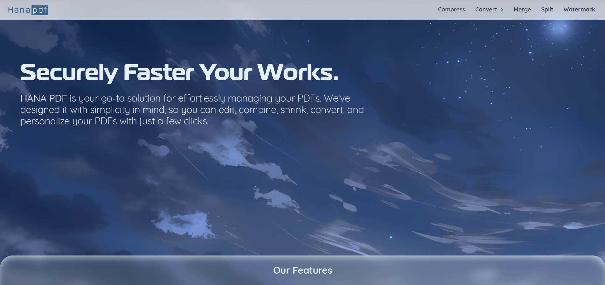

## HANA PDF
HANA PDF is a __Laravel__ based project powered by front-end framework like __ViteJS__ and __Tailwind CSS__ and used of __Flowbite__ library to maintain responsive and materialize interface. And with integration from __iLovePDF__ and __Aspose Cloud__ API as one of the back-end, it have feature to merge, split, compress, convert, and add watermarks to PDF documents, that can handle easily and quickly.

---



---

### Requirements [For development with local environment]
- [Apache 2.4](https://httpd.apache.org) or [Nginx](https://www.nginx.com)
- [Composer](http://getcomposer.org/)
- [Docker](https://www.docker.com/)
    * On Windows use Docker Desktop
    * On Linux use docker-compose and docker.io
- [Node JS 20.11](https://nodejs.org/en)
- [Flowbite](https://flowbite.com/)
- [PHP 8.2.12](https://www.php.net/downloads.php)
- [PostgreSQL 16.2](https://www.postgresql.org/)
- [Python 3.10.x](https://www.python.org/downloads/release/python-31011/)
- [Tailwind CSS](https://tailwindcss.com/)
- [Vite JS](https://vitejs.dev/)

---

### Python Module Requirements
- Requests

---

### Build Status
- [](https://github.com/Nicklas373/Hana-PDF/actions/workflows/github-code-scanning/codeql)
- [](https://github.com/Nicklas373/Hana-PDF/actions/workflows/docker-sit-env.yml)
- [](https://github.com/Nicklas373/hana-ci-docker-prod/actions/workflows/docker-prod-env.yml)

---

### Deployment On Docker [YOUR_LOCAL_IP_ADDRESS:80]
#### Step to configure
1. Clone the repository with __git clone__
2. Go to root directory from this project
3. Start to deploy
    - Windows based [Using docker desktop]
        ```bash
        - docker compose up -d
        - docker compose exec hana-container-instance php artisan migrate
        - docker stats
        ```
    
    - Linux based [Using docker.io & docker-compose]
        ```bash
        - sudo docker-compose up -d
        - sudo docker-compose exec hana-container-instance php artisan migrate
        - sudo docker stats
        ```
4. Configure REST API and Telegram Notification
    - Windows based [Using docker desktop]
        ```bash
        - docker compose exec hana-container-app-pdf echo "TELEGRAM_BOT_ID=YOUR_TELEGRAM_BOT_ID" >> .env
        - docker compose exec hana-container-app-pdf echo "TELEGRAM_CHAT_ID=YOUR_TELEGRAM_CHANNEL_ID" >> .env
        - docker compose exec hana-container-app-pdf echo "TOKEN_GENERATE=YOUR_ENCODE_SHA512_TOKEN" >> .env
        ```
    
    - Linux based [Using docker.io & docker-compose]
        ```bash
        - sudo docker-compose exec hana-container-app-pdf echo "TELEGRAM_BOT_ID=YOUR_TELEGRAM_BOT_ID" >> .env
        - sudo docker-compose exec hana-container-app-pdf echo "TELEGRAM_CHAT_ID=YOUR_TELEGRAM_CHANNEL_ID" >> .env
        - sudo docker-compose exec hana-container-app-pdf echo "TOKEN_GENERATE=YOUR_ENCODE_SHA512_TOKEN" >> .env
        ```
---

### Deployment On Native OS Host
#### Step to configure
1. Clone the repository with __git clone__
2. Copy __.env.example__ file to __.env__ and modify database credentials
3. Add additional environment into __.env__ with this string (Add yourself value :p)
````bash
- ASPOSE_CLOUD_CLIENT_ID="ASPOSE_CLOUD_CLIENT_ID" [https://dashboard.aspose.cloud/]
- ASPOSE_CLOUD_TOKEN="ASPOSE_CLOUD_TOKEN" [https://dashboard.aspose.cloud/]
- ADOBE_CLIENT_ID="ADOBE_CLIENT_ID" [https://developer.adobe.com/document-services/docs/overview/pdf-embed-api/]
- FTP_USERNAME="FTP_USERNAME" [https://dashboard.aspose.cloud/]
- FTP_USERPASS="FTP_USERPASS" [https://dashboard.aspose.cloud/]
- FTP_SERVER="FTP_SERVER" [https://dashboard.aspose.cloud/]
- ILOVEPDF_ENC_KEY="ILOVEPDF_ENC_KEY" [Generate your hash key (Max. 25 digits)]
- ILOVEPDF_PUBLIC_KEY="ILOVEPDF_PUBLIC_KEY" [https://developer.ilovepdf.com/]
- ILOVEPDF_SECRET_KEY="ILOVEPDF_SECRET_KEY" [https://developer.ilovepdf.com/]
- ILOVEPDF_EXT_IMG_DIR="temp-image"
- PDF_MERGE_TEMP="temp-merge"
- PDF_UPLOAD="upload-pdf"
- PDF_DOWNLOAD="temp"
- TELEGRAM_BOT_ID="YOUR_TELEGRAM_BOT_ID" [https://telegram-bot-sdk.com/docs/getting-started/installation]
- TELEGRAM_CHAT_ID=YOUR_TELEGRAM_CHANNEL_ID [https://telegram-bot-sdk.com/docs/getting-started/installation]
- TOKEN_GENERATE=YOUR_ENCODE_SHA512_TOKEN
````
4. Run the following command [Make sure to configure database connectivity before use migrate function]
```bash
- composer install
- php artisan key:generate
- php artisan storage:link
- php artisan migrate
```
5. Create new directory inside storage/app/public
    - temp
    - temp-image
    - temp-merge
    - upload-pdf
6. Start to deploy
    ```bash
    - npm run dev -- --host
    - php artisan serve --host=localhost --port=80
    ```
    
---

### Technology Stack
- [Aspose](https://www.aspose.cloud/)
- [Docker](https://www.docker.com/)
- [Flowbite](https://flowbite.com/)
- [iLovePDF](https://developer.ilovepdf.com/)
- [Node JS](https://nodejs.org/en)
- [Python](https://www.python.org/)
- [Tailwind CSS](https://tailwindcss.com/)
- [Vite JS](https://vitejs.dev/)

---

### License
The HANA-CI PDF is a open source Laravel Project that has licensed under the [MIT license](https://opensource.org/licenses/MIT).

---

## HANA-CI Build Project 2016 - 2024
